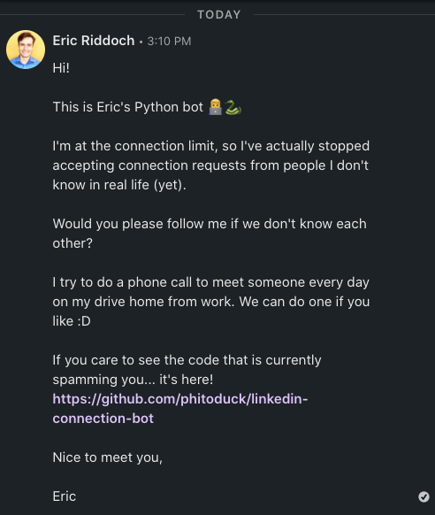
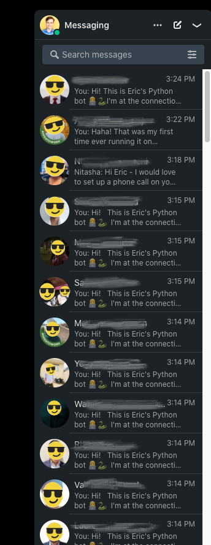

# Eric's Python Bot 👨‍💻 🐍

Welcome! If you're here, there's a 99% chance you were spammed by this bot 🤣





## What does this do?

This is a script that takes your Linkedin email and password, loops over the list of people who have sent
you a connection request, and sends them an unpersonalized message of your choice.

It also stores a *local* YAML file called `messaged-people.yaml` where the names of your connection-request-ers
are saved so that you don't send a message to someone more than once.

### FYI

Currently this project is *just* a script. There isn't anything available for automatically deploying it somewhere.

If you know about CRON, you could use that to schedule this script to run on an interval... then again,
if you know about CRON, you probably know a bunch of ways you can run a script :D

Eventually, I may make a script to create an AWS lambda function and DynamoDB table for you
to run this on a schedule. That would be useful to have in general.

## Can I use this?

Sure, if you really want to.

Here are the steps to install this and run it locally:

### 1. Clone this Repository

### 2. Add your Linkedin Credentials

Copy the `.example.env` file in the repository and name it `.env`. Fill it out with your credentials like so:

```bash
LINKEDIN_EMAIL=joe.bob@gmail.com
LINKEDIN_PASSWORD=apple123
```

### 3. Install the dependencies and run the script! 🚀

These instructions alone run the script in "headless" mode. If you just run these,
you won't be able to watch 

#### Option 1. Pure Python 🐍

| You must have the Firefox 🔥 🦊 browser installed for this to work.

```bash
# create a virtual environment (should be python 3)
python -m venv venv/

# activate the virtual environment
source venv/bin/activate/

# install the dependencies
/bin/bash make.sh install # python -m pip install .

# run the script
/bin/bash make.sh run # python src/linkedin_bot/main.py
```

#### Option 2. Docker 🐳

| You must have `docker` and/or Docker Desktop installed for this to work.

```bash
# build the docker image
/bin/bash make.sh build-image # docker-compose build

# run the script!
/bin/bash make.sh run-docker # docker-compose run linkedin-bot
```

## Notes

When you log in for the first time, your session cookies are saved to `cookies.json` so that
you won't have to log in again if you run the script again before your session expires.

There is a problem with this ^^^, though. The script doesn't check to see if the cookies are
still valid, so you'll need to manually delete `cookies.json` if you go a long time without
running the script.